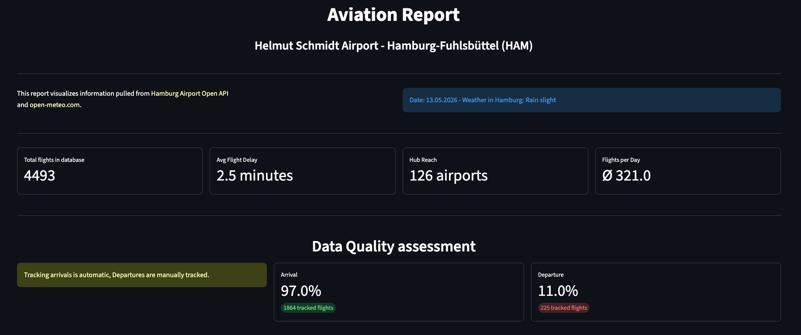
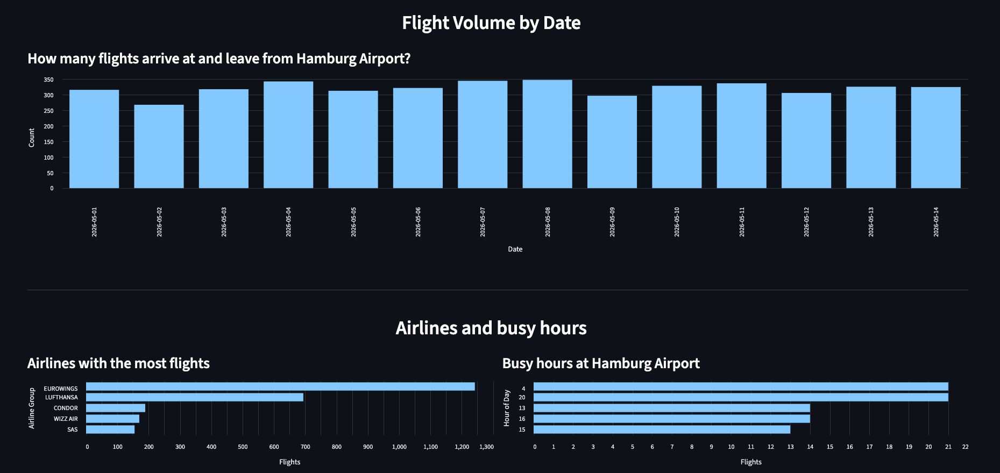
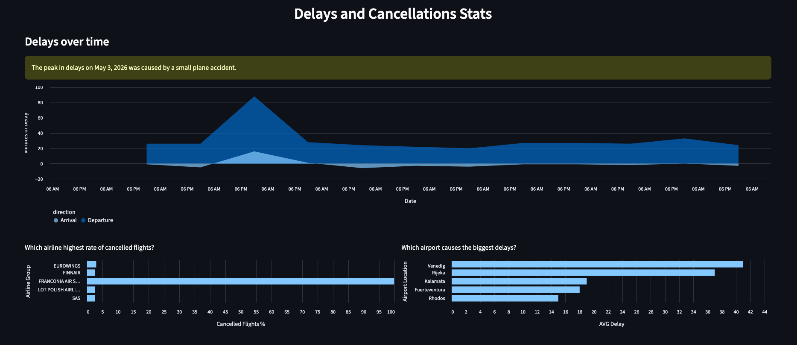
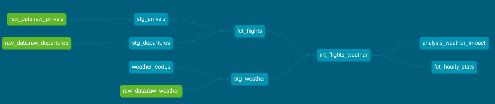
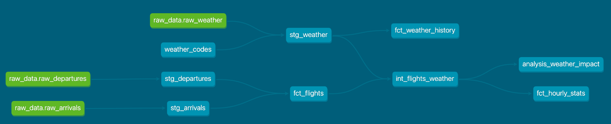
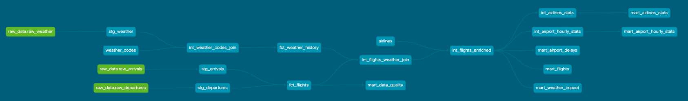

# Hamburg Aviation Report

## Hamburg Airport Data Pipeline: Development Log

### **1. Environment & dbt Setup**

* **Infrastructure:** Initialized dbt with `dbt-postgres` for a **Supabase** backend.


* **Connectivity:** Switched to a connection pooler for IPv4 compatibility to resolve initial `dbt debug` failures.


* **Medallion Strategy:** Adopted the **Bronze -> Silver -> Gold** architecture.


### **2. Bronze Layer: Extraction & Load**

* **Landing Zone:** Created a `raw` schema in Supabase for landing API data.


* **Extraction Script:** Developed `extract_flights.py` using `sqlalchemy` and `pandas`.


* **Database Patterns:** Implemented a **truncate and append** pattern within a single transaction (`engine.begin()`) to handle data updates without dropping tables dependent on downstream dbt views.


### **3. Silver Layer: Transformation & Logic**

* **Staging:** Overrode column names and handled Postgres case-sensitivity using quotes.


* **Timestamp Engineering:** Used Regex to strip `[Europe/Berlin]` noise from ISO strings, converting them to `timestamptz`.


* **Macros (DRY):** Centralized logic into two macros to handle repetitive calculations across arrivals and departures:


```sql
-- Delay Calculation

    case
        when {{ cancelled }} is true then null
        when {{ actual_time }} is not null and {{ planned_time }} is not null 
            then extract(epoch from ({{ actual_time }} - {{ planned_time }})) / 60
        else null
    end


-- Status Classification

    case
        when {{ cancelled }} is true then 'Cancelled'
        when {{ actual_time }} is null then 'Unknown'
        else 'Completed'
    end


```

* **Intermediate Layer:** Shifted joins (Weather, Airline Groups) and volatile calculations from incremental tables to the `int_flights_enriched` view to ensure a single, flexible source of truth.


### **4. Weather & External Data Integration**

* **Orchestration:** Created a `main.py` orchestrator to manage multiple API calls (Airport API + Open-Meteo API).


* **Weather History:** Implemented an incremental model (`fct_weather_history`) to persist weather data beyond the API's sliding forecast window.


* **Seeds:** Integrated a weather code mapping seed and an **Airline Grouping** seed generated via Python fuzzy matching (`rapidfuzz`).


### **5. Gold Layer: Analytics & Marts**

* **Materialization:** Used **Incremental Models** for `fct_flights` to enable historical analysis while minimizing duplicate processing.


* **Performance:** Optimized the Gold layer with persistent tables to ensure the Streamlit app renders metrics quickly.


* **Granularity:** Provided both high-level daily summaries and detailed hourly statistics.


### **6. Critical Data Quality Insights**

* **Tracking Disparity:** Discovered that **Arrivals** use automated radar logging (highly accurate), while **Departures** rely on manual entry, resulting in only ~5% of departures having actual timestamps.


* **Refinement:** Filtered analysis to focus on "Completed" flights (where `actual_time` exists) to prevent massive outliers in delay metrics caused by missing data.


### **7. Streamlit Dashboard**

* **Architecture:** Modularized the app into `loader.py` (caching/SQL) and `charts.py` (visualizations).


* **Validation:** Used hourly volume charts to validate the incremental growth of the database.


* **Insights:** Shifted from "Explanatory" (weather correlation) to "Descriptive" (airline volume and data quality tracking) after observing that operational issues often outweighed weather impacts.

# Screenshots

## Dashboard




## Lineage Graph Evolution




### Tech Stack:
- Flight data from [Hamburg Airport API](https://www.hamburg-airport.de/de/open-api-20708)
- Weather data from [Open-Meteo](https://open-meteo.com/) 
- Data modelling with [dbt](https://docs.getdbt.com/?version=1.12)
- Visualizations made with [Streamlit](https://streamlit.io/) 
- PostgreSQL database on [Supabase](https://supabase.com/)
